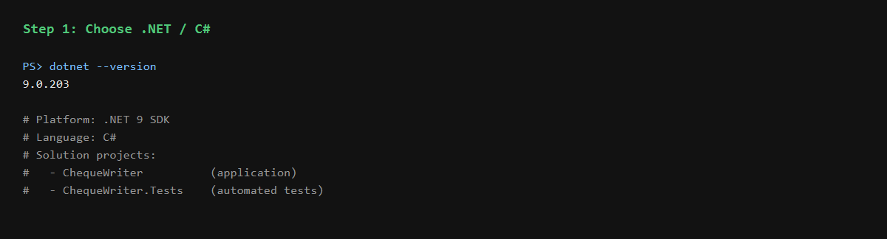
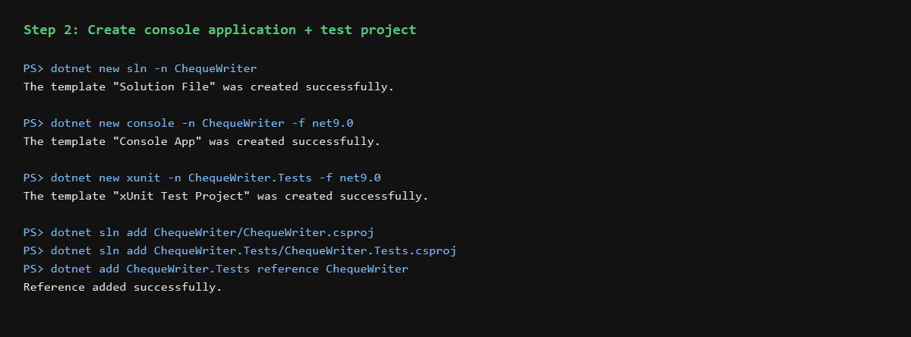
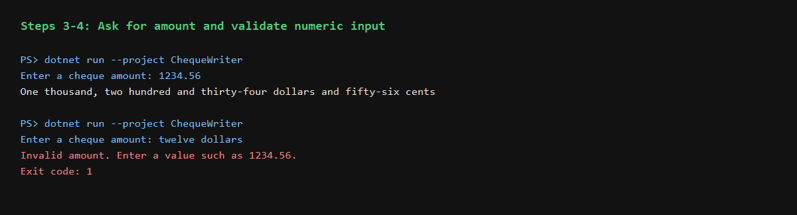
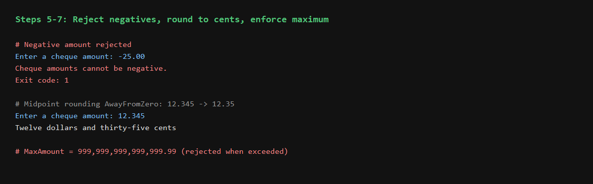
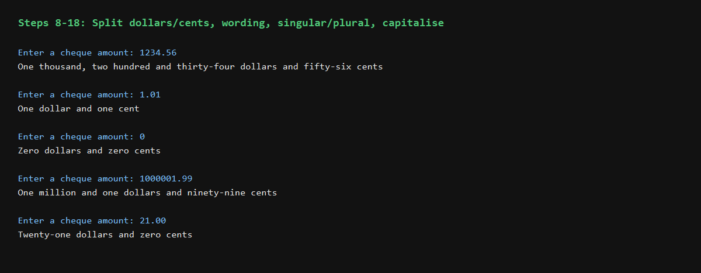
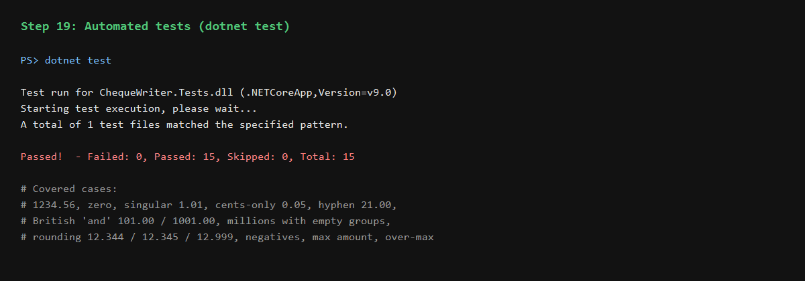
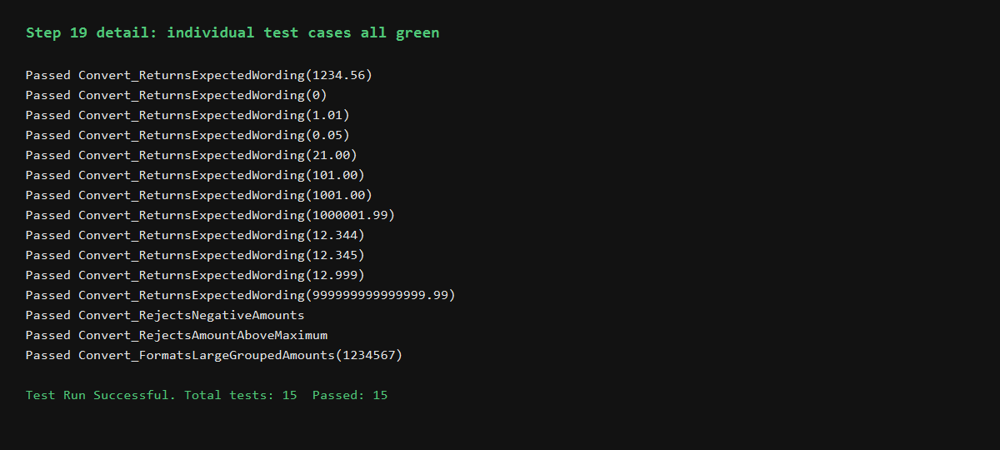

# ChequeWriter — Step-by-Step Build Log

Plain-English cheque amount converter built exactly as described: numeric amount in, New Zealand/British wording out.

**Example:** `1234.56` → `One thousand, two hundred and thirty-four dollars and fifty-six cents`

---

## Part 1: Creating the application

### Step 1 — Choose .NET

Used the .NET 9 SDK with C#. The solution has two projects:

| Project | Purpose |
|---------|---------|
| `ChequeWriter` | Console application (conversion logic + UI) |
| `ChequeWriter.Tests` | Automated xUnit tests kept separate from the app |



### Step 2 — Create a console application

Created the solution, console app, and test project:

```powershell
dotnet new sln -n ChequeWriter
dotnet new console -n ChequeWriter -f net9.0
dotnet new xunit -n ChequeWriter.Tests -f net9.0
dotnet sln add ChequeWriter/ChequeWriter.csproj
dotnet sln add ChequeWriter.Tests/ChequeWriter.Tests.csproj
dotnet add ChequeWriter.Tests reference ChequeWriter
```

When run, the program prompts:

```text
Enter a cheque amount:
```



---

## Part 2: Reading and validating the amount

### Steps 3–4 — Ask for input and validate it is a number

`Program.cs` displays the prompt with `Console.Write`, reads text with `Console.ReadLine()`, then uses `decimal.TryParse` with `CultureInfo.InvariantCulture`.

- Valid: `1234.56`
- Invalid: `twelve dollars` → clear error, exit code 1

`decimal` is used because financial amounts need decimal precision (not binary floating-point).



---

## Part 3: Preparing the amount for conversion

### Steps 5–7 — Negatives, rounding, maximum

Handled inside `ChequeAmountConverter.Convert`:

1. **Reject negatives** — throws `ArgumentOutOfRangeException`
2. **Round to nearest cent** — `decimal.Round(..., 2, MidpointRounding.AwayFromZero)`
3. **Enforce maximum** — `MaxAmount = 999_999_999_999_999.99m`

Examples:

| Input | Result |
|-------|--------|
| `-25.00` | Rejected |
| `12.345` | Rounded to `12.35` → *Twelve dollars and thirty-five cents* |
| above max | Rejected with maximum message |



---

## Parts 4–7: Conversion pipeline (Steps 8–18)

Implemented in `ChequeWriter/ChequeAmountConverter.cs`:

| Step | Responsibility |
|------|----------------|
| 8–9 | Split dollars (`Truncate`) and cents (`(amount - dollars) * 100`) |
| 10–11 | `Ones[]` (0–19) and `Tens[]` (twenty–ninety) word tables |
| 12 | `ConvertUnderOneThousand` — hundreds + British/NZ **and** |
| 13–15 | Scale groups (trillion→units), skip empty groups, commas / final **and** |
| 16–18 | Convert dollars & cents, singular/plural units, assemble + capitalise |



### Method breakdown (Part 8)

| Method | Job |
|--------|-----|
| `Convert` | Validate, round, split, label, capitalise |
| `ConvertInteger` | Whole numbers via named scales |
| `ConvertUnderOneThousand` | One group from 1–999 |
| `JoinGroups` | Commas and placement of **and** |
| `CapitaliseFirstLetter` | Sentence capitalisation |

---

## Part 9: Testing (Step 19)

Ran:

```powershell
dotnet test
```

**Result: 15/15 passed**





### Test cases covered

| # | Input | Expected / result |
|---|-------|-------------------|
| 1 | `1234.56` | One thousand, two hundred and thirty-four dollars and fifty-six cents |
| 2 | `0` | Zero dollars and zero cents |
| 3 | `1.01` | One dollar and one cent |
| 4 | `0.05` | Zero dollars and five cents |
| 5 | `21.00` | Twenty-one dollars and zero cents |
| 6 | `101.00` | One hundred and one dollars and zero cents |
| 7 | `1001.00` | One thousand and one dollars and zero cents |
| 8 | `1000001.99` | One million and one dollars and ninety-nine cents |
| 9 | `12.344` | Twelve dollars and thirty-four cents |
| 10 | `12.345` | Twelve dollars and thirty-five cents |
| 11 | `12.999` | Thirteen dollars and zero cents |
| 12 | `-1.00` | Rejected |
| 13 | `twelve dollars` | Invalid amount message (console) |
| 14 | `999999999999999.99` | Full scale wording accepted |
| 15 | above max / `1234567` | Rejected / large grouped wording |

---

## How to run

```powershell
# Application
dotnet run --project ChequeWriter

# Tests
dotnet test
```

---

## Production note (as in the brief)

Before production use, confirm with the business:

1. Whether fractions of a cent should be **rounded** (current behaviour) or **rejected**
2. Whether wording should end with **only** (e.g. *… cents only*)
